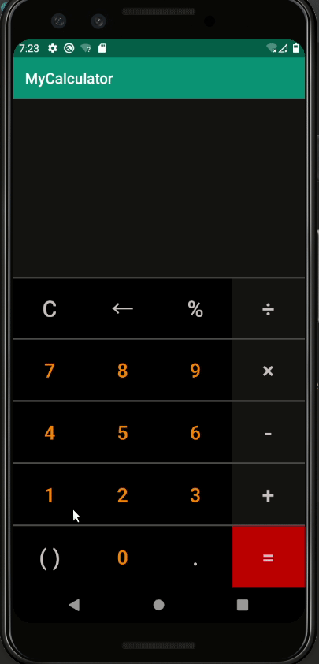
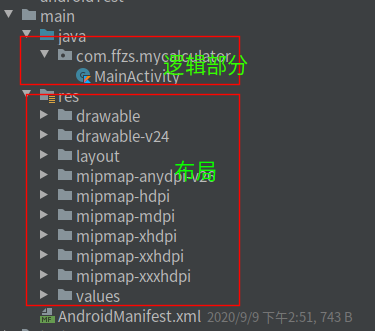
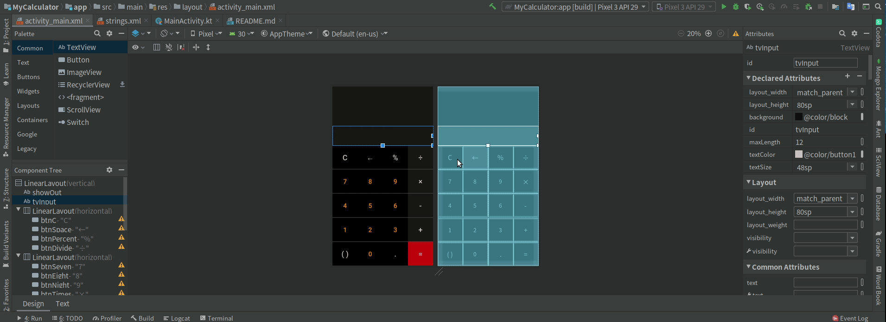
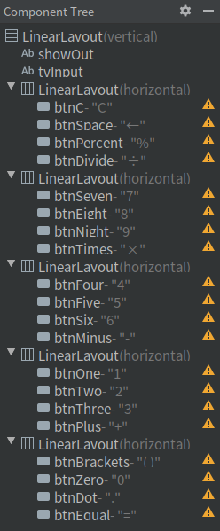

# Android & Kotlin：打造自己的计算器

一直很好奇Android开发是个什么样的体验，最近赋闲在家，时间宽裕，找了几个教学视频跟着体验一下，顺便练习一下学的Kotlin，于是乎就写了一个计算器，感觉还像那么回事儿。

先上效果图：



## 

## 1. kotlin

+ Kotlin （科特林）是一个用于现代多平台应用的静态编程语言   ，由 JetBrains（知名IDE开发公司，如idea，pycharm） 开发。
+ Kotlin可以编译成Java字节码，也可以编译成JavaScript，方便在没有JVM的设备上运行。除此之外Kotlin还可以编译成二进制代码直接运行在机器上（例如嵌入式设备或 iOS）。
+ 2017年Kotlin正式成为Android官方支持开发语言。
  kotlin对Android的支持很好，对许多地方进行了简化，如直接通过id使用组建。
+ kotlin还对web框架也有支持，如spring，vert.x。
+ 与java相比弥补了java的一些不足。
+ 语言风格和typescript相近，有向前端靠拢的意思（一统江湖？）

## 2. Android

这个就不介绍了。。

android项目主要分为两个部分：

+ 逻辑部分
+ layout



其中布局通过xml文件关联组建，设置一些参数，逻辑部分对组建部分进行更改状态等一些处理。

### 2.1 layout部分

使用Android studio或idea创建的Android项目中layout部分的xml文件打开是有两个功能：

+ text：就是xml文件的代码
+ design：可视化为一个工作台，通过拖拽等操作生成xml文件中代码，更直观一些



## 3. 样式布局

Android的布局其实和html的还是有很多相似之处的。做过前端的理解这个应该很简单

### 3.1 宽高

### layout_width， layout_height

+ match_parent：尽可能的覆盖全
+ wrap_content：尽可能的小，完全贴合内容
+ 80sp：定长

### 3.2 分布方向

orientation

+ vertical：垂直方向
+ horizontal: 水平方向

### 3.3 颜色

background， textColor

+ 可以通过values文件中的colors中进行设置，有点类似less中的设置方法

```java
android:background="@android:color/background_dark"
```

### 3.4 id

跟前端一样，如果需要进行逻辑处理就需要指定id关联js

### 3.5 布局

layout_weight

+ 通过比重设置组建在layout中站位的比重

### 3.5 操作

+ 通过关联到逻辑部分的函数，出入函数一个view，前端多是event
+ 逻辑部分进行操作更改layout内容

```java
android:onClick="onDigit"
```

## 4. 逻辑部分

直接在java部分写函数

+ 传入view为触发操作组建
+ 通过传入内容更改layout中组件的某些内容

```kotlin
fun onDigit(view: View) {
    if (!lastEqual)
        tvInput.append((view as Button).text)
        lastNum = true
}
```

## 5.计算器实现

### 5.1 布局设计

+ button一行一个`linearlayout`
+ button通过权重进行分布
+ 显示部分分两部分，上部分存储之前的输入情况，下部分为操作区
+ 操作符和数值通过颜色做以区分



### 5.2 输入操作

通过输入类型来区分使用函数，分为：

+ 数值
+ 小数点
+ 操作符
+ clear键
+ backspace键
+ 等于键

**数值**：

```java
fun onDigit(view: View) {
    if (!lastEqual)
        tvInput.append((view as Button).text)
        lastNum = true
}
```

**清除键：**

+ 直接将字符串设为空
+ 将各种状态还原

```java
fun onClear(view: View) {
    tvInput.text = ""
    lastNum = false
    lastOperator = false
    lastDot = false
    lastEqual = false
}
```

**退回键：**

+ 由于TextView没有remove功能，使用扩展函数写一个
+ 返回过程中如果遇到小数点或是操作符，也要复原其状态

```kotlin
private fun TextView.backSpace () {
    if (text.isNotEmpty()) {
        when(text.last()){
            '.' -> lastDot = false
            '-', '+', '×', '÷', '%' -> lastOperator = false
        }
        text = text.subSequence(0, text.length - 1)
    }
}

fun onBackSpace(view: View) {
    tvInput.backSpace()
}
```

**小数点**：

+ 一个数中只能有一个小数点要控制好
+ 小数点前要有数值

```kotlin
fun onDecimalPoint(view: View) {
    if (lastNum && !lastDot) {
        tvInput.append(".")
        lastNum = false
        lastDot = true
    }
}
```

**操作符**：

+ 操作符前要有数值（其实`-`号可以没有，为了简化不处理这部分逻辑了）
+ 只能出现一次操作符，操作符之后小数点状态还原

```kotlin
fun onOperator(view: View) {
    if (lastNum && !lastOperator) {
        operator = (view as Button).text.toString()[0]
        tvInput.append(view.text)
        lastOperator = true
        lastNum = false
        lastDot = false
        lastEqual = false
    }
}
```

**等于号：**

+ 通过操作符切分为两个字符串，代表两个数值
+ 通过模式匹配进行计算处理
+ mun2为0的时候需要报错
+ 将之前的输入内容添加到list中通过上面屏幕进行显示

```kotlin
@SuppressLint("SetTextI18n")
fun onEqual() {
    if (lastNum && lastOperator) {
        val oldText = tvInput.text.toString()
        val (s1, s2) = oldText.split(operator)
        val num1 = s1.toDouble()
        val num2 = s2.toDouble()
        var ret: Double? = null
        when(operator) {
            '×' -> ret = num1 * num2
            '+' -> ret = num1 + num2
            '÷' -> if (num2 != 0.0) ret = num1 / num2
            '-' -> ret = num1 - num2
            '%' -> ret = num1 % num2
        }
        textList.removeAt(0)
        textList.add(oldText)
        showOut.text = textList.joinToString("\n")
        val nf: NumberFormat = NumberFormat.getNumberInstance()
        nf.maximumFractionDigits = 6
        if (ret==null) {
            tvInput.text = "Error"
        }else{
            tvInput.text = nf.format(ret)
        }
        lastDot = true
        lastEqual = true
        lastOperator = false
    }
}
```


## 6. 源码

github：